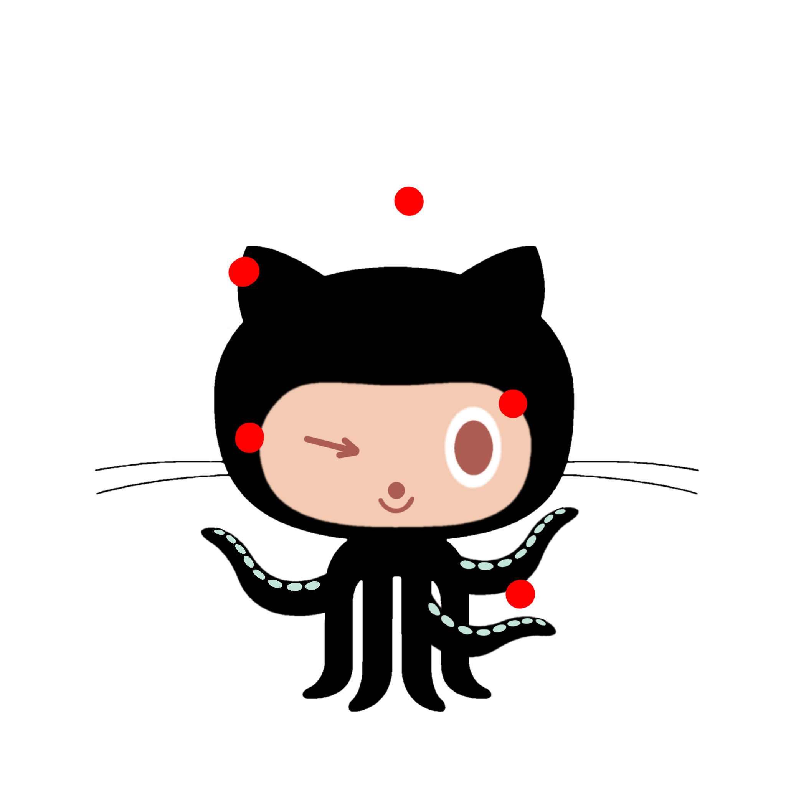

<div align="center">
  

  # Octo-Juggler 🤹

  **Gamify your GitHub Profile!**

  [](LICENSE)
  []()
  [](https://octocat.yups.me)

  [Why?](#why) •
  [How to Use](#-how-to-use) •
  [Deployment](#-deployment) •
  [Collaboration](#-collaboration)
</div>

---

## Why?

GitHub profiles can be a bit... static. **Octo-Juggler** adds a dynamic, retro-arcade style badge to your README. The Octocat juggles balls representing your open source contributions from the past week.

**More Repos = More Balls = More Fun!**

It's a fun way to visualize your weekly activity and add some life to your profile.

---

## 🚀 How to Use

1.  **Insert Coin**: Log in securely with your GitHub account at **[octocat.yups.me](https://octocat.yups.me)**.
2.  **Get Your Badge**: Copy the generated Markdown snippet.
3.  **Paste & Play**: Add it to your profile `README.md`.

Example snippet:
```markdown
[](https://octocat.yups.me/stats/YOUR_USERNAME)
```

---

## 🛠️ Deployment

This project allows you to host your own instance.

### Prerequisites
- Docker & Docker Compose
- A GitHub OAuth App (Callback URL: `http://YOUR_DOMAIN/auth/github/callback`)

### Quick Start

1.  **Clone the repo**
    ```bash
    git clone https://github.com/JaviLopezG/octocat.git
    cd octocat
    ```

2.  **Configure Environment**
    Copy `.env-example` to `.env` and fill in your credentials.
    ```bash
    cp .env-example .env
    # Edit .env with your GITHUB_CLIENT_ID, GITHUB_CLIENT_SECRET, etc.
    ```

3.  **Run with Docker**
    ```bash
    docker-compose up -d
    ```

4.  **Reverse Proxy (Optional)**
    Use the provided `Caddyfile-example` to set up Caddy as a reverse proxy with automatic HTTPS.

---

## 🎨 Collaboration

**We need YOU!**
The current pixel art is "programmer art". If you have pixel art skills and want to contribute better sprites (eyes, mouths, backgrounds...), please:

1.  Fork this repo.
2.  Check the `assets/` folder structure.
3.  Send a Pull Request!
4.  For questions or ideas, open a [Discussion](https://github.com/JaviLopezG/octocat/discussions) or [Issue](https://github.com/JaviLopezG/octocat/issues).

For private matters, contact `mail@javilopezg.com`.

---

## ⚖️ Disclaimer

> [!CAUTION]
> **This project is NOT affiliated with, endorsed by, or connected to GitHub, Microsoft, or any of their subsidiaries.**
> "Octocat" is a trademark of GitHub, Inc. Used here for fan-art/parody purposes under fair use principles.

> [!NOTE]
> **Bernardo:** Peace & Love! ✌️
> Antigravity is built by Google, but runs in a world built on tools from everywhere (yes, including Microsoft). Let's celebrate the developer ecosystem together!

---

<div align="center">
  <br>
  © 2026 Javi López G. | BSD-3-Clause License
</div>

<!--
Assisted-by: Antigravity
-->
